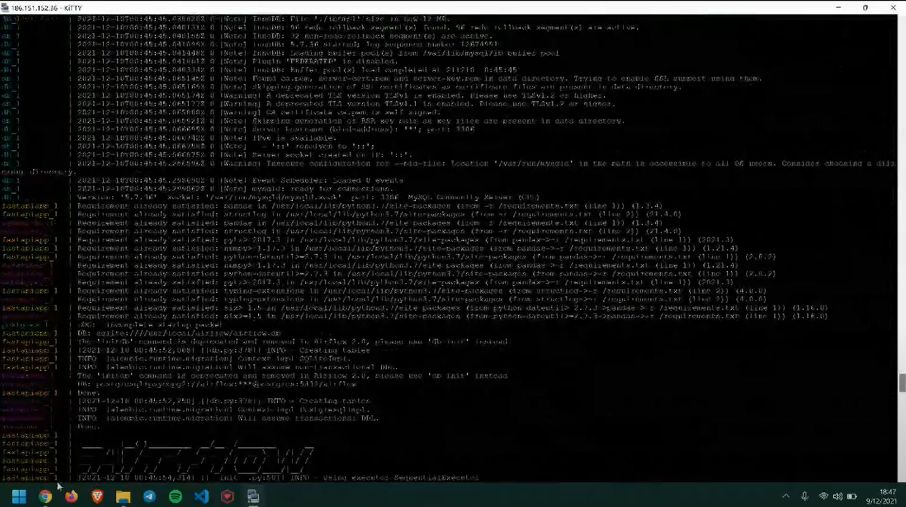
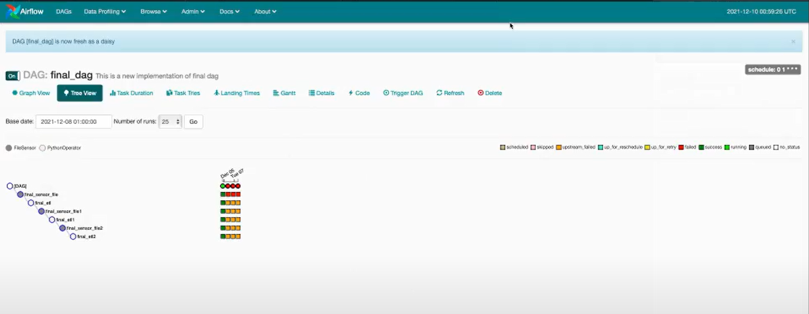
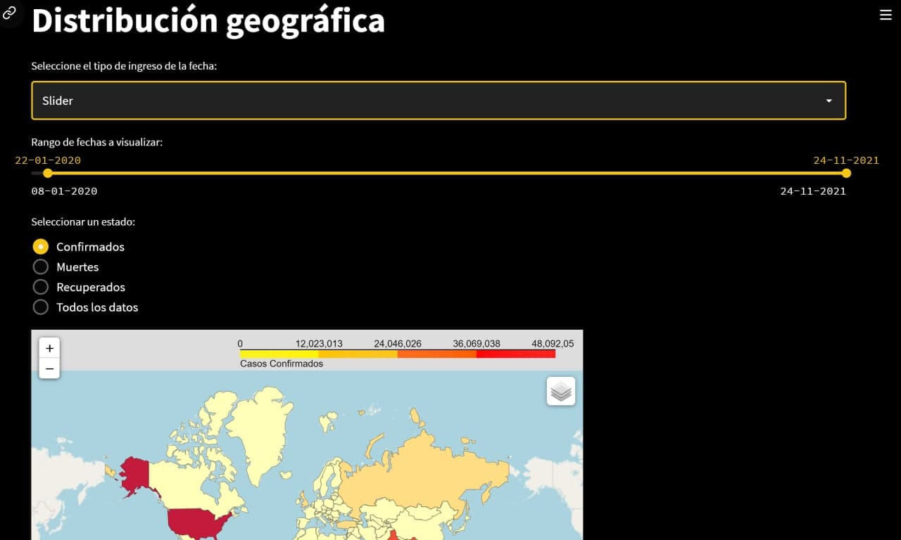
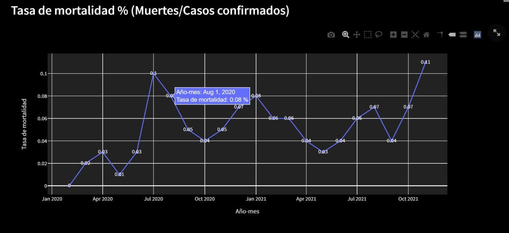

### Integrantes del grupo:

- Eddson Sierra

- Alejandro López

- Jairo Salazar

- Diego Martínez

- Sergio Palma

### Covid 19 Dashboard
Utilizando los datos provistos, los cuales contienen información sobre los contagios, las recuperaciones y las muertes, dados por país y región. Se solicita que usted construya un data pipeline que procese los 3 archivos csv, los inserte a una base de datos, y luego basado en los datos procesados, debe construir un dashboard que permite analizar las estadísticas de cada uno de los archivos.

<a href="page1.html">- Desarrollo</a>
 
 
<a href="page2.html">- Uso</a>

 
### Fases de Desarrollo
### Instalación, configuración y ejecución

La instalación del proyecto se encuentra en el repositorio, distribuido de la siguiente forma:

- data_sources: Contiene los archivos originales del proyecto.
- images: Imagenes utilizadas para el dashboard.

#### Docker
A continuación se describe la instalación y funcionamiento del contenedor de Docker utilizado en el proyecto:

##### Pull del archivo.
- docker build . -t fastapi_app
- docker-compose build
- docker-compose run airflow-init
- docker-compose up

#### Base de Datos
Estructura y funcionalidad de las tablas utilizadas:

 
#### Ingesta de Datos
Proceso realizado para carga y procesamiento de la información estadistica:

##### DAGS utilizados:

##### Estructura de la base de datos:

### Dashboard
#### Caracteristicas y funcionalidad:
1. Muestra información geografica de los siguientes datos:
- Activos
- Recuperados
- Fallecidos

2. Esta información puede ser filtrada geograficamente.

3. Puede obtenerse la tasa de mortalidad.

